##ОТЧЁТ О ЛАБОРАТОРНОЙ РАБОТЕ №6 
## ПО ОСНОВАМ ПРОГРАММИРОВАНИЯ

###Ход работы:
На сайте GitHub сделал копию https://github.com/Kurtyanik/LR6/
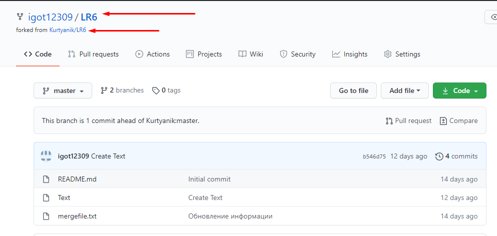
С помощью команды _cd Desktop/lab6_ в консоли Git Bash перешёл в созданную на рабочем столе папку lab6
Использовал команду _git init_ чтобы инициализировать гит в данной папке
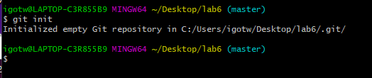
Командой _git remote add origin_ связал папку с удалённым репозиторием на сайте GitHub
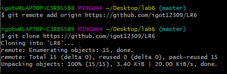
Затем через графический интерфейс GitHub добавил новый файл _Index.html_ в удалённый репозиторий и добавил его в ветку __master__
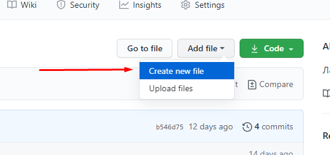
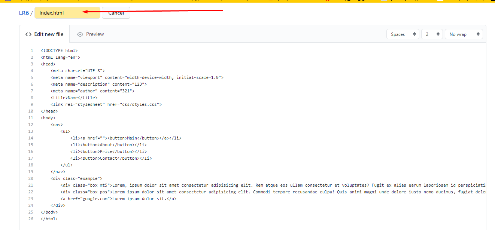
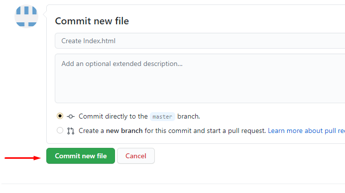
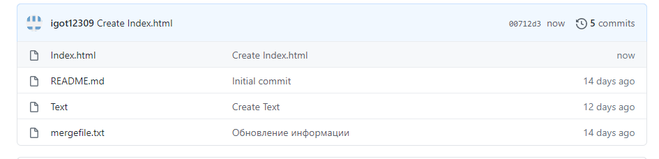
Пользуясь командой _git pull origin master_ загрузил изменения из удалённого репозитория в локальный
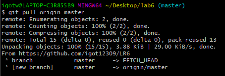
Командой _git log_ получил список операций/коммитов
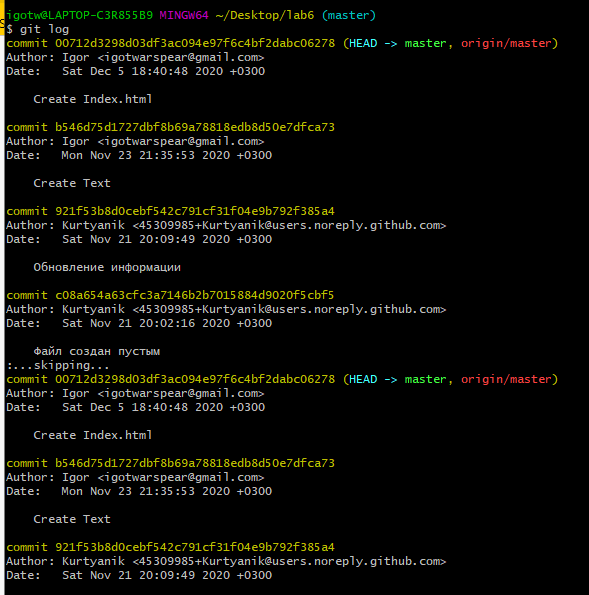
Используя _git show *commit SHA-1*_ получил более подробную информацию по последнему изменению
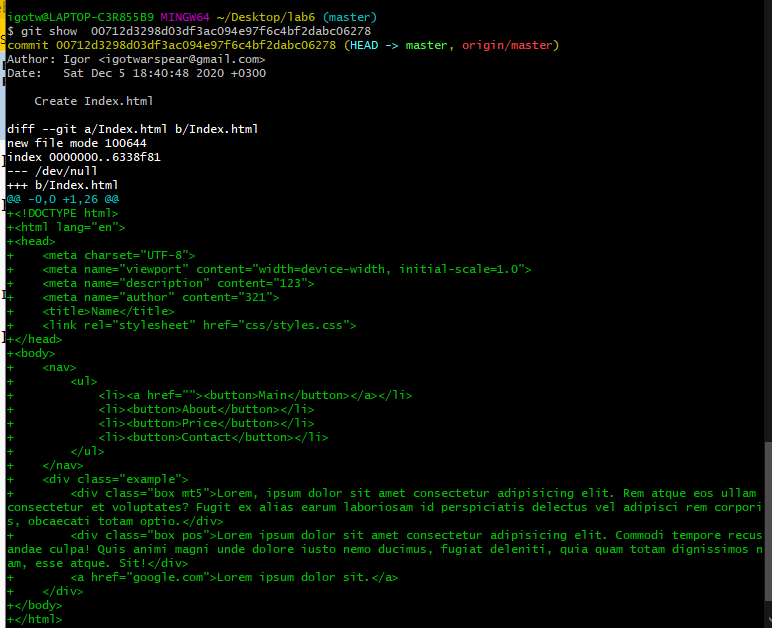
Командой _git checkout -t branch1_ переключился на другую ветку **branch1**
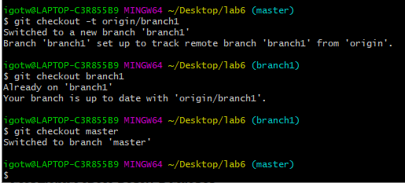
Попытался выполнить слияние веток **master** и **branch1** командой _git merge branch1_ и получил ошибку

Вручную изменил файл mergefile.txt, вызвавший ошибку слияния и выполнил коммит
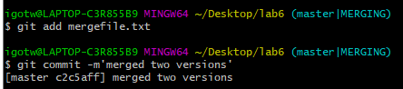
Выполнил слияние веток **master** и **branch1** а затем удалил ветку **branch1** командой _it
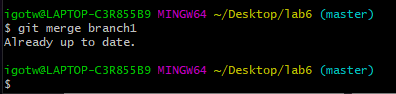
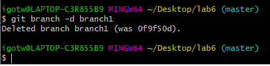
Запушил всё в удалённый репозиторий командой _git push origin master_ (Строка logon failed вылезает из-за какой-то внутренней ошибки)
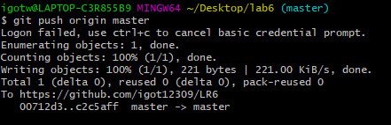
Затем сделал несколько изменений, добавив новые файлы
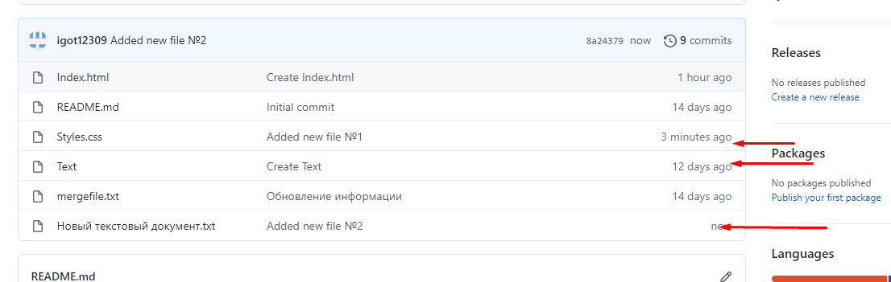
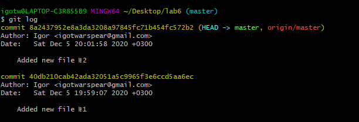
Командой _git reset --hard HEAD~1_ выполнил откат последнего коммита - добавления файла **Новый текстовый документ.txt**
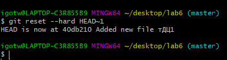
Запушил изменённую ветку
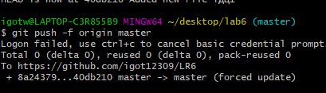
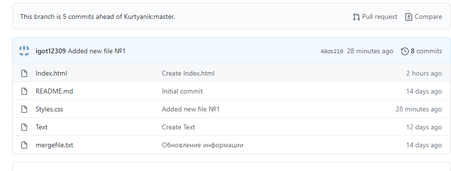
Пользуясь командой _git checkout -b otchet_ создал новую ветку **otchet**
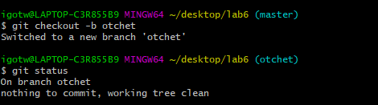
Текущая история _git log --graph_ . Аргумент --graph позволяет графически изобразить ветки и коммиты на них

С помощью команды _git add ._ подготовил все новые файлы в папке **lab6** к пушу
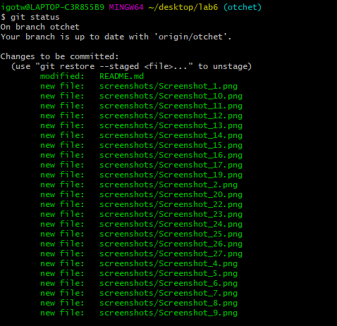
Запушил файлы скриншотов в удалённый репозиторий
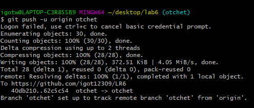
Оформляю отчёт в файле **README.md** используя блокнот
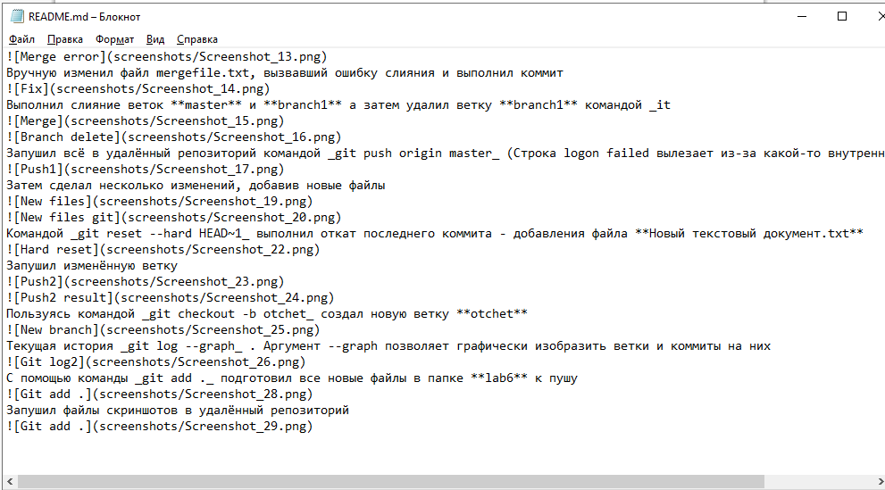

Лог команд из папки **.git/logs**
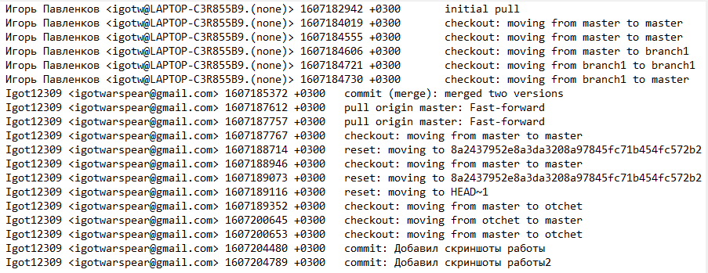
Финальный результат команды _git log_
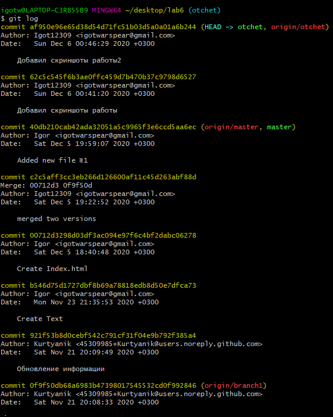
Все файлы скриншотов лежат в папке **screenshots**