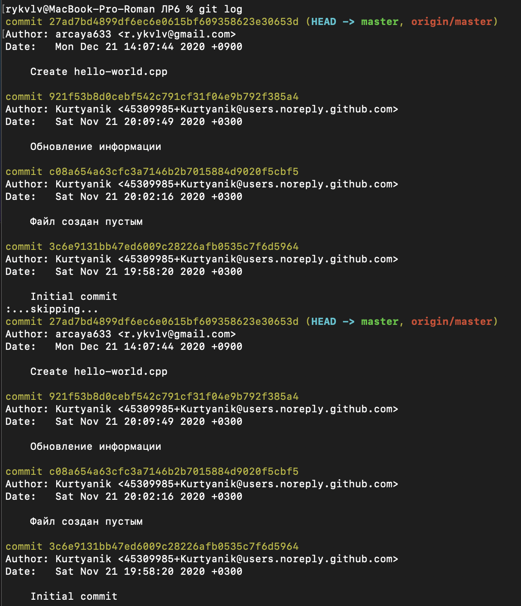
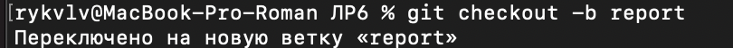

# LR6
Лабораторная работа №6

### Ход работы:
Зашел в репозиторий https://github.com/Kurtyanik/LR6/ и скопировал в свои репозитории

Через терминал зашел в нужную директорию на диске компьютера и ввел комманду git init, связал удаленный репозиторий с папкой с помощью команды git remote add origin и клонировал на локальный репозиторий

С помощью графического интерфейса на удаленном репозитории создал файл hello-world.cpp и запуллил коммит с помощью комманды git pull на локальный репозиторий

Команда git log показывает все действия в репозитории

Команда git show покажет конкретные изменения по последнему коммиту

Переключимся на ветку branch1 с помощью git checkout -t origin/branch1
Переключимся обратно на master и попробуем объединить ветки, но получим ошибку

Исправляем конфликт в файле mergefile.txt

После изменения файла добавляем его для коммита командой git add, делаем коммит и повторяем попытку, а затем удаляем branch1

Производим push изменений на удаленный репозитиорий

Далее сделаем изменения в удаленном репозитории. Создадим три файла, один из которых окажется бесполезным:

Обновим локальный репозиторий и посмотрим логи

Откатимся до последнего коммита и запушим изменения на удаленный репозиторий

Как видим, последний коммит был удален

Создадим новую ветку report

Также мы можем посмотреть логи в графическом виде

В ветку report добавим наши скриншоты и посмотрим статус ветки, который показывает, какие изменения будут совершены следующим коммитом

Делаем коммит и пушим на удаленный репозиторий

